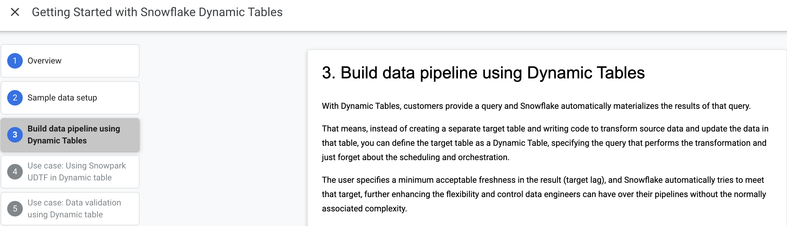

# Dynamic Tables Hands-On

This lab will use the [Dynamic Tables Quickstart] (https://quickstarts.snowflake.com/guide/getting_started_with_dynamic_tables/index.html?index=..%2F..index#0) to demonstrate the ease and flexibility of Snowflake Dynamic Tables.

[0-setup.sql](0-setup.sql) contains all of the scripts necessary to setup the Quickstart.  

Start the lab at Quickstart Step 3:
https://quickstarts.snowflake.com/guide/getting_started_with_dynamic_tables/index.html?index=..%2F..index#2
