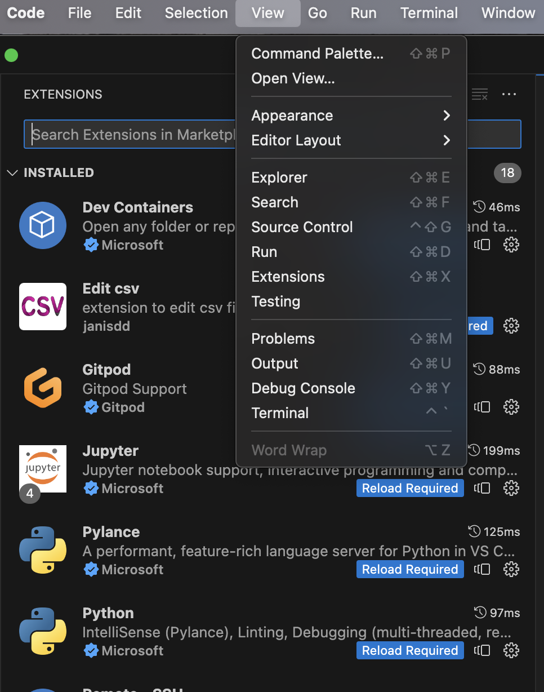
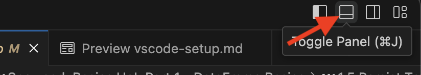
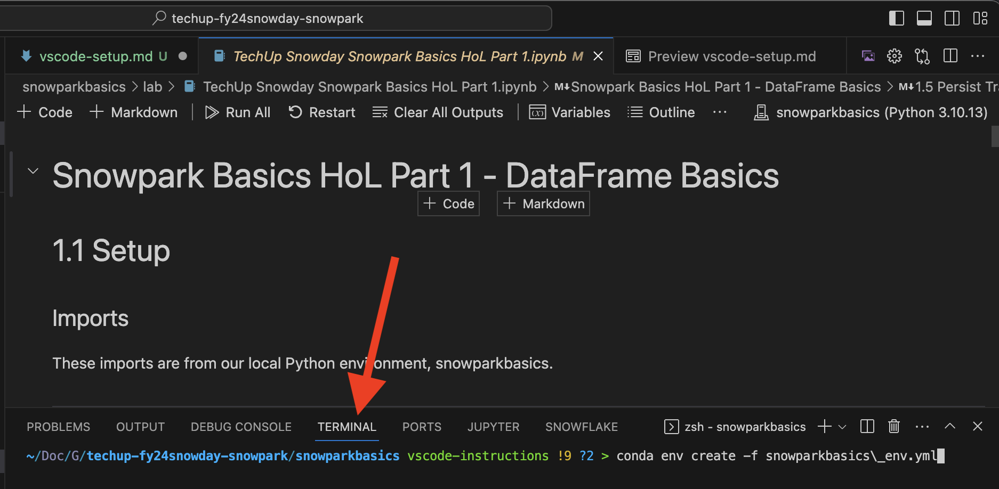
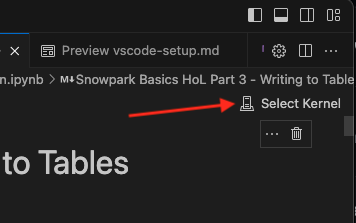
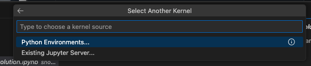
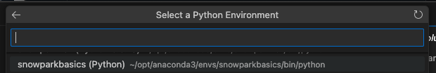
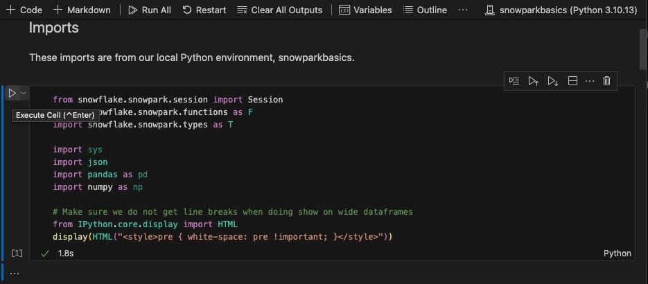
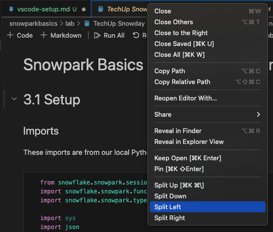

# VS.Code Setup

## Prerequisites
- VS Code install - https://code.visualstudio.com/download

## Step 1 - Ensure Extensions
VS Code is generally intuitive for detecting/recommending extensions, and prompting if one isn't found. For these labs, you will want the Python and Jupyter extensions installed (via the View --> Extensions menu).

## Step 2 - Install conda environment
From within VS Code, toggle the terminal panel from the upper left (or Command-J on Mac):

From the terminal tab, use the conda command from the README to create a new conda environment:

## Step 3 - Open a notebook
When you open a Jupyter notebook, you should see an option in the upper left to "Select Kernel".  This is where you will choose the conda environment you wish to use for that specific notebook.

Selecting that will open a panel that will allow you to choose your conda enviroment.  Since you've already created one ("snowparkbasics"), you simply have to choose it:

## Step 4 - Run the notebook!
From here, you should be ready to run your notebook!

## Hints / Tips
- To see a "rendered" view of a markdown (.md) document, on a Mac open the file and press Command-Shift-V 
- VS Code allows you to "split screen", which is *incredibly* useful for a HOL.  (E.g., you can see the instructions/examples in one view, and your editing cell in another.)  Simply right-click on your open tab and choose 'Split Left/Right':

